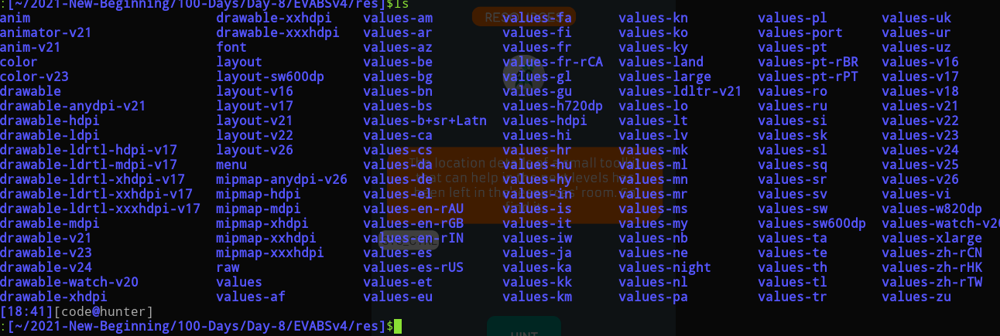
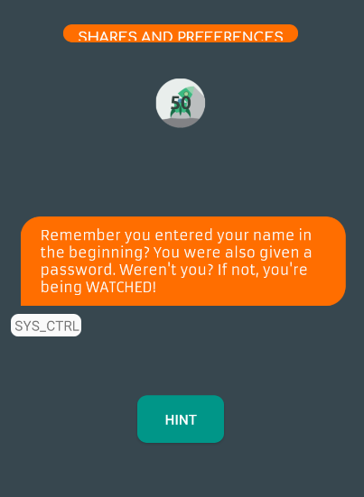

# Day-8 Practice time for Android Security Testing

------


```
I choosed  allsafe

https://github.com/abhi-r3v0/EVABS

```


------


Now First download the apk file =>


https://github.com/abhi-r3v0/EVABS/releases/download/v4/EVABSv4.apk


------


### Challenges


### #Level 1. Debug Me


Yeah Level 1 Done


```
What I learn ?

See that input is sensitive
When click on that buttion then theat being logged inthe system logs so it is vulnerable

As the same way in the real time mobile applications first we have to identify the sensitive input fields

An application contains lot of input fields example login, credit card, address information

We have to verify logging at all input fields

Sometimes  authentication token also may leak via logs.

Tool I used => pidcat

https://github.com/JakeWharton/pidcat

It only shows log entries for processes from a specific application package.

We can also use logcat command

adb logcat > logcat and then do as same as above

also can try =>

adb logcat -v brief | pidcat com.revo.evabs
```

------


### #Level 2. File Access


Ok so hint is to check assets directory of an apk file


lets check it


Now lets use apktool command


FLAG => EVABS{fil3s_!n_ass3ts_ar3_eas!ly_hackabl3}


```
What I learn ?

Many sensitive things can be or might be available in apk file under assets directory so must check this directory 

```


------


### #Level 3.  Strings


who so need to check xml file for strings


so i can see many xml files are present in => res/values directory


and strings.xml file present there 

> we must know that strings.xml file present in res/values directory


>    <string name="the_evabs_api_key">EVABS{saf3ly_st0red_in_Strings?}</string>


perfect


So, flag is => EVABS{saf3ly_st0red_in_Strings?}


------


### #Level 4.  Resources


Let's google => where resources are located in android


i can see ==> /res directory





So, there we already check values and another important thing i can see is raw directory


So, there is link.txt file


Flag =>EVABS{th!s_plac3_is_n0t_as_s3cur3_as_it_l00ks}


Btw HINT was =>


Done


```
What I learn ?

We must explore res directory for sensitive things and even raw directory
```


------


### #Level 5.  Shares and Prefs





again google time =>


# [Where are shared preferences stored?](https://stackoverflow.com/questions/6146106/where-are-shared-preferences-stored)


Ans =>


> SharedPreferences are stored in an xml file in the app data folder, i.e.
>
> ```
> /data/data/YOUR_PACKAGE_NAME/shared_prefs/YOUR_PREFS_NAME.xml
> ```
>
> or the default preferences at:
>
> ```
> /data/data/YOUR_PACKAGE_NAME/shared_prefs/YOUR_PACKAGE_NAME_preferences.xml
> ```
>
> SharedPreferences added during runtime are not stored in the Eclipse project.
>
> Note: Accessing `/data/data/<package_name>` requires superuser privileges


> ​    <string name="password">EVABS{shar3d_pr3fs_c0uld_be_c0mpromiz3ds}</string>


Flag => EVABS{shar3d_pr3fs_c0uld_be_c0mpromiz3ds}


```
What I learn ?

Shared preferences allow you to store small amounts of primitive data as key/value pairs in a file on the device. To get a handle to a preference file, and to read, write, and manage preference data, use the SharedPreferences class. The Android framework manages the shared preferences file itself. The file is accessible to all the components of your app, but it is not accessible to other apps.


Android SharedPreferences — a common component of Android applications — are a set of APIs that manages for the developer data of every type, providing a clean way to permanently store and retrive them from the device. Them are used almost in every android app

So, our input data or can say even credentials saved in shared preferneces directory
```


------


### #Level 6. DB Leak


Clicked on Fetch Creds


Google => mainframe access android db


got answer sqlite


Also check hint


Perfect


```
What I learn?

when we fetch db details from an any app then a database folder will be created in the application and there we can see db details and using sqlite we can see complete details there

If we see creds in plain text then this is security problem
```

------

